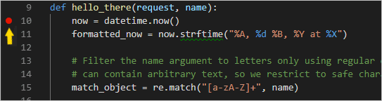
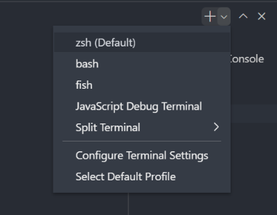
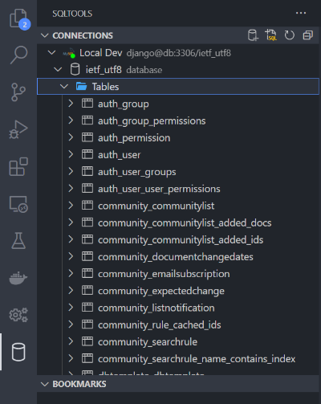
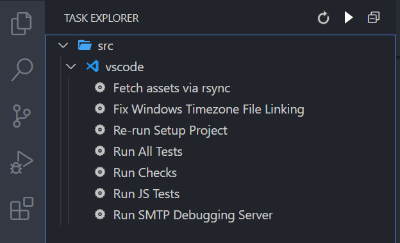
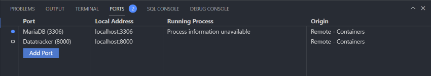

# Datatracker Development in Docker

## Getting started

1. [Set up Docker](https://docs.docker.com/get-started/) on your preferred platform. On Windows, it is highly recommended to use the [WSL 2 *(Windows Subsystem for Linux)*](https://docs.docker.com/desktop/windows/wsl/) backend.

2. On Linux, you must also install [Docker Compose](https://docs.docker.com/compose/install/). Docker Desktop for Mac and Windows already include Docker Compose.

2. If you have a copy of the datatracker code checked out already, simply `cd`
   to the top-level directory.

   If not, check out a datatracker branch as usual. We'll check out `trunk`
   below, but you can use any branch:

    ```sh
    svn co https://svn.ietf.org/svn/tools/ietfdb/trunk
    cd trunk
    ```

3. Follow the instructions for your preferred editor:
    - [Visual Studio Code](#using-visual-studio-code)
    - [Other Editors / Generic](#using-other-editors--generic)

## Using Visual Studio Code

This project includes a devcontainer configuration which automates the setup of the development environment with all the required dependencies.

### Initial Setup
        
1. Launch [VS Code](https://code.visualstudio.com/)
2. Under the **Extensions** tab, install the **Remote - Containers** ([ms-vscode-remote.remote-containers](https://marketplace.visualstudio.com/items?itemName=ms-vscode-remote.remote-containers)) extension installed. On Windows, you also need the **Remote - WSL** ([ms-vscode-remote.remote-wsl](https://marketplace.visualstudio.com/items?itemName=ms-vscode-remote.remote-wsl)) extension to take advantage of the WSL 2 *(Windows Subsystem for Linux)* native integration.
2. Open the top-level directory of the datatracker code you fetched above.
3. A prompt inviting you to reopen the project in containers will appear in the bottom-right corner. Click the **Reopen in Container** button. If you missed the prompt, you can press `F1`, start typing `reopen in container` task and launch it.
4. VS Code will relaunch in the dev environment and create the containers automatically.
5. You may get several warnings prompting you to reload the window as extensions get installed for the first time. Wait for the initialization script to complete before doing so. *(Wait for the message `Done!` to appear in the terminal panel.)*

### Subsequent Launch

To return to your dev environment created above, simply open **VS Code** and select **File** > **Open Recent** and select the datatracker folder with the `[Dev Container]` suffix.

You can also open the datatracker project folder and click the **Reopen in container** button when prompted. f you missed the prompt, you can press `F1`, start typing `reopen in container` task and launch it.

### Usage

- Under the **Run and Debug** tab, you can run the server with the debugger attached using **Run Server** (F5). Once the server is ready to accept connections, you'll be prompted to open in a browser. You can also open [http://localhost:8000](http://localhost:8000) in a browser.
    
    > An alternate profile **Run Server with Debug Toolbar** is also available from the dropdown menu, which displays various tools 
    on top of the webpage. However, note that this configuration has a significant performance impact.

    To add a **Breakpoint**, simply click to the left of the line gutter you wish to stop at. You can also add **Conditional Breakpoints** and **Logpoint** by right-clicking at the same location.

    

    While running in debug mode (`F5`), the following toolbar is shown at the top of the editor:

    

    See this [tutorial](https://code.visualstudio.com/docs/python/tutorial-django#_explore-the-debugger) on how to use the debugging tools for Django in VS Code.

- An integrated terminal is available with various shell options *(zsh, bash, fish, etc.)*. Use the **New Terminal** button located at the right side of the Terminal panel. You can have as many as needed running in parallel and you can use split to display multiple at once.

    

- Under the **SQL Tools** tab, a connection **Local Dev** is preconfigured to connect to the DB container. Using this tool, you can list tables, view records and execute SQL queries directly from VS Code.

    > The port `3306` is also exposed to the host automatically, should you prefer to use your own SQL tool.

    

- Under the **Task Explorer** tab, a list of available preconfigured tasks is displayed. *(You may need to expand the tree to `src > vscode` to see it.)* These are common scritps you can run *(e.g. run tests, fetch assets, etc.)*.

    

- From the command palette (`F1`), the command **Run Test Task** allows you to choose between running all tests or just the javascript tests.

- The **Ports** panel, found in the Terminal area, shows the ports currently mapped to your host and if they are currently listening.

    

## Using Other Editors / Generic

1. From the terminal, in the top-level directory of the datatracker project:

    On Linux / macOS:

    ```sh
    cd docker
    run
    ```

    On Windows:
    ```sh
    cd docker
    docker-compose -f docker-compose.yml -f docker-compose.extend.yml up -d
    docker-compose exec app /bin/sh /docker-init.sh
    ```

2. Wait for the containers to initialize. Upon completion, you will be dropped into a shell from which you can start the datatracker and execute related commands as usual, for example

    ```
    ietf/manage.py runserver 0.0.0.0:8000
    ```

    to start the datatracker.

    Once the datatracker has started, you should be able to open [http://localhost:8000](http://localhost:8000) in a browser and see the landing page.

    Note that unlike the VS Code setup, a debug SMTP server is launched automatically. Any email will be discarded and logged to the shell.

### Exit Environment

To exit the dev environment, simply enter command `exit` in the shell.

The containers will automatically be shut down on Linux / macOS.

On Windows, type the command (from the `docker/` directory)

```sh
docker-compose down
```

to terminate the containers.

### Clean / Rebuild / Fetch Latest DB Image

To delete the active DB container, its volume and get the latest image / DB dump, simply run the following command:

On Linux / macOS:

```sh
cd docker
cleandb
```

On Windows:
```sh
cd docker
docker-compose down -v
docker-compose pull db
docker-compose build --no-cache db
```

### Accessing MariaDB Port

The port is exposed but not mapped to `3306` to avoid potential conflicts with the host. To get the mapped port, run the command *(from the project `/docker` directory)*:
```sh
docker-compose port db 3306
```

## Notes / Troubleshooting

### Windows .ics files incorrectly linked

When checking out the project on Windows, the `.ics` files are not correctly linked and will cause many tests to fail. To fix this issue, run the **Fix Windows Timezone File Linking** task in VS Code or run manually the script `docker/scripts/app-win32-timezone-fix.sh`

The content of the source files will be copied into the target `.ics` files. Make sure not to add these modified files when committing code!

### Missing assets in the data folder

Because including all assets in the image would significantly increase the file size, they are not included by default. You can however fetch them by running the **Fetch assets via rsync** task in VS Code or run manually the script `docker/scripts/app-rsync-extras.sh`
